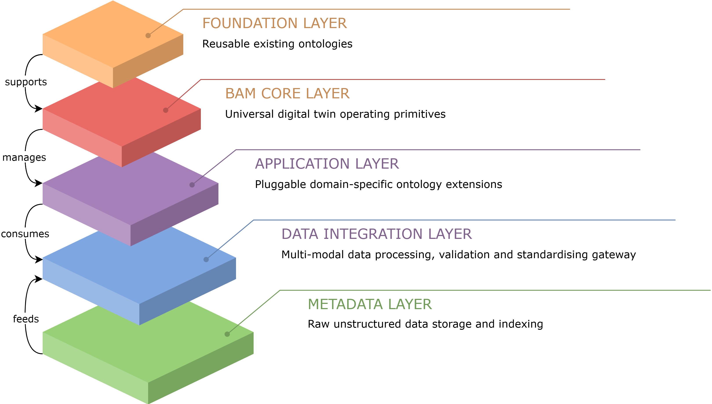
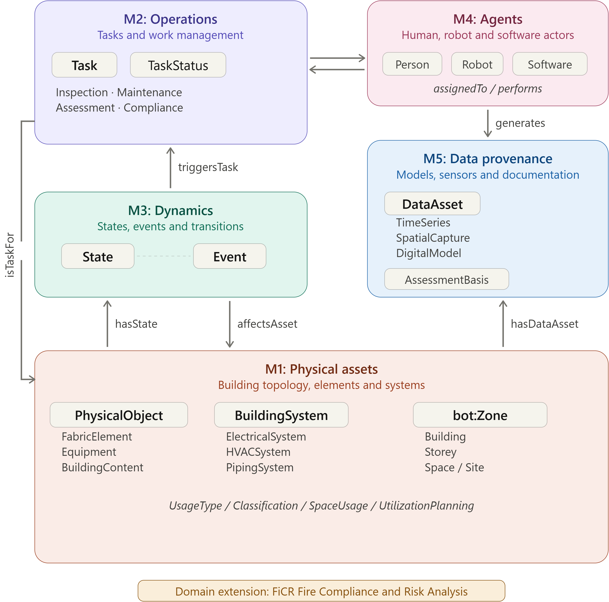

# BAM — Building Asset Management Ontology

> **BOMO → BAM:** The ontology was renamed from BOMO to BAM to shift focus from operational workflows to the **physical assets** that buildings are composed of — their topology, elements, equipment, and systems. Domain-specific applications are developed as **modular extensions** rather than built into the core.

> **🔥 Active Development: [FiCR (Fire Compliance and Risk Analysis)](https://github.com/RainGo111/FiCR-ontology)** is the first and most actively developed BAM extension, targeting **automated fire safety compliance checking and risk assessment** in existing buildings. It serves as both a standalone contribution to fire safety informatics and a proof of concept for BAM's extensibility architecture.
>
>  &ensp; **Namespace:** `https://w3id.org/bam/ficr#`

---

**BAM** is a top-level domain ontology for building digital twins during the
operation, maintenance, and renovation stages of a building's lifecycle.
It integrates building spatial topology, physical assets, equipment systems,
sensor data, maintenance activities, and data provenance at the semantic
level — designed as a **thin core with rich domain extensions**.

BAM is founded on alignment with the
[Building Topology Ontology (BOT)](https://w3id.org/bot#), with designed
extensibility toward [Brick Schema](https://brickschema.org/) and
[RealEstateCore](https://realestatecore.io/).

- **Namespace:** `https://w3id.org/bam#`
- **Prefix:** `bam:`
- **Serialisation:** OWL 2 / Turtle (`.ttl`)
- **Version:** 0.1.0

## Five-Layer Architecture

BAM is organised into five layers, from raw data at the bottom to
reusable foundation ontologies at the top:

| Layer | Role |
| --- | --- |
| **Foundation** | Reusable existing ontologies (BOT, Brick, SSN, etc.) |
| **BAM Core** | Universal digital twin operating primitives (M1–M5) |
| **Application** | Pluggable domain-specific extensions (e.g. FiCR) |
| **Data Integration** | Multi-modal data processing, validation and standardisation |
| **Metadata** | Raw unstructured data storage and indexing |

## Core Modules

BAM Core consists of five fundamental modules. Together they cover the
minimal vocabulary needed to describe a building, its occupants and
operators, what happens inside it, and how we know.

1. **M1: Physical Assets** — Building topology (`bot:Zone`), fabric
   elements, equipment, building systems, and content. M1 anchors every
   other module to a spatial context derived from BOT.

2. **M2: Operations** — Task lifecycle, work orders, inspection and
   compliance workflows. M2 connects operational activities to the assets
   they affect and the agents who carry them out.

3. **M3: Dynamics** — State snapshots and event tracking for assets and
   systems. M3 captures how building conditions change over time, enabling
   temporal queries across the asset base.

4. **M4: Agents** — Human, robotic, and software actors that perform tasks.
   M4 provides a uniform representation regardless of whether an action is
   carried out by a facility manager, a drone, or an automated script.

5. **M5: Data Provenance** — Sensor time-series, spatial captures (point
   clouds, images), digital models, and assessment evidence. M5 records
   where data came from, when it was collected, and what it supports.

Unlike application ontologies tied to a single platform or use case, BAM
provides a shared conceptual backbone that domain-specific extensions can
specialise without breaking interoperability. Each extension inherits BAM's
spatial grounding, provenance model, and agent framework, ensuring that
cross-domain queries remain coherent.

## License

This project is licensed under the [MIT License](LICENSE).
